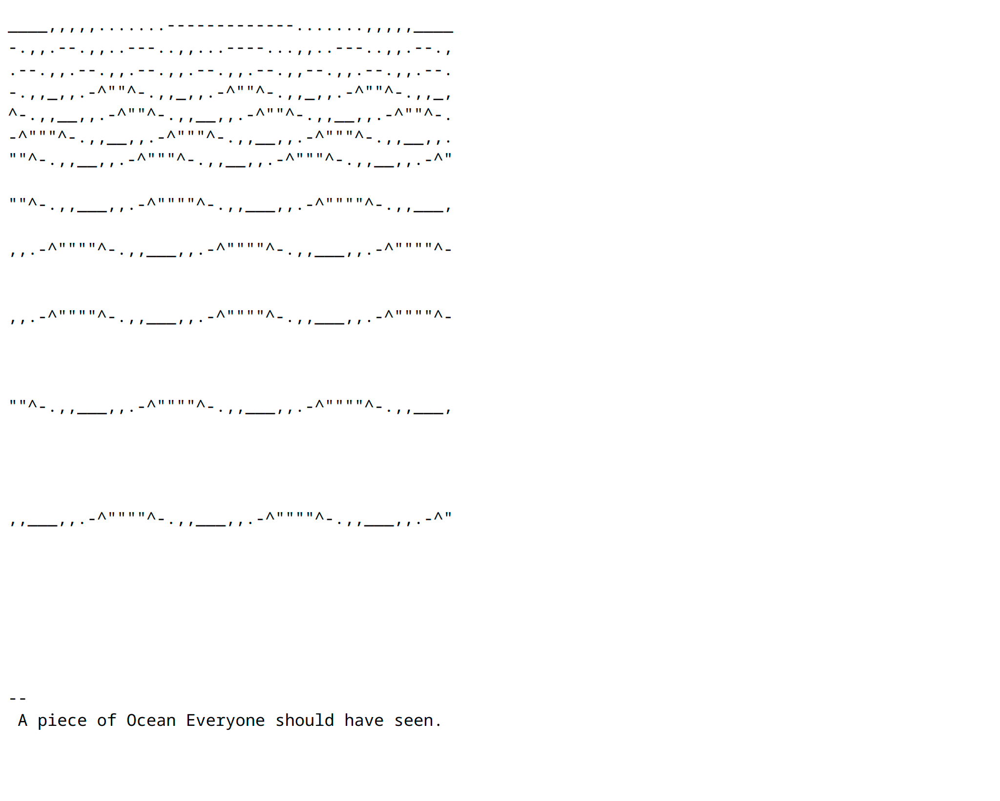

# 37.205.9.239

> "A piece of Ocean Everyone should have seen." - The text on the website reads

Fun ASCII art. So be it!

  
More details

  Note: The page lacks classic HTML markup (well, it's just not there at all). The server returns raw ascii in the response, without an html page.

  

---

- Link (orig): [http://37.205.9.239/](http://37.205.9.239/) [FOLLOW THE LINKS AT YOUR OWN RISK.]
- Link (mirror) [37-205-9-239.www.ffaaee.art](https://37-205-9-239.www.ffaaee.art) [BETTER USE A SAFE MIRROR OF THE WEBSITE.]
- Link (post) [www.ffaaee.art/37.205.9.239](https://www.ffaaee.art/37.205.9.239)
